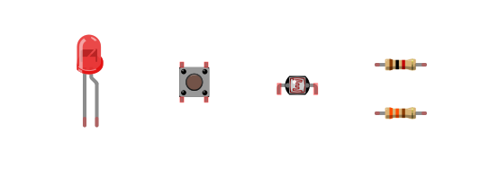
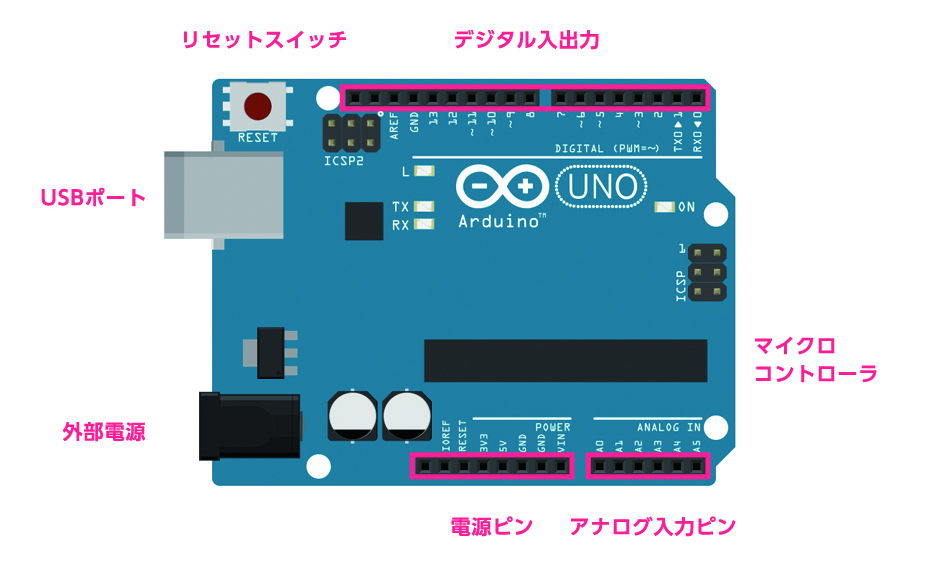
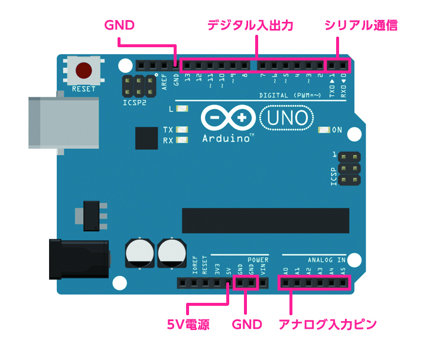

# 01.Aruduinoとは

フィジカルコーンピューティングとかってよく言いますが、  シンプルな入出力とProcessing言語で実装された開発環境がベースになったもの。  
単体でも使えますが、Flashとか、Processing、OF、Max/MSPとかと一緒に使う。  
ソフトウェア（IDE）もオープンソースでDLできます。

アーティストやデザイナー、学生ががもっと気軽にインタラクティブなコンテンツを開発するために作られました。

### 公式サイト
[https://www.arduino.cc/](https://www.arduino.cc/)

Aruduino UNOが主流

### Aruduinoの種類  
[https://www.arduino.cc/en/Main/Products](https://www.arduino.cc/en/Main/Products)

- Aruduino UNO 3,240円  
- Arduino Leonardo 3,024円
- Arduino Fio（ワイヤレス）3117円
- LilyPad Arduino 328（服に縫い付ける） 2,492円

※ピンの数、動作電圧、メモリーの容量が違います。

### UNOとLEONARDOの違い
- Leonardoの方がI/Oが多い
- KeyboardやMouseデバイスが簡単に作れる
- 標準USB-Type B

#### littlebits  
電子工作の知識不要だが、高価

[http://jp.littlebits.com/](http://jp.littlebits.com/)

#### USBキーボードエンコーダー 
とても簡単だが、ON/OFFだけで、数値などは取れない。
プログラミングできない。
[http://shop.bird-electron.co.jp/shopdetail/018000000014/](http://shop.bird-electron.co.jp/shopdetail/018000000014/)

#### Arduino
安価で、プログラミング可能
ちょっと勉強必要だが、フォーラムや書籍が充実してるので安心。

---

## どんな物が作れるか

#### NFC  
[https://learn.adafruit.com/babel-fish](https://learn.adafruit.com/babel-fish)

#### 無線（Xbee）  
真鍋大度＋石橋素 「particles」ができるまで  
[http://www.cbc-net.com/topic/2011/05/daito-motoi-particles-ycam/](http://www.cbc-net.com/topic/2011/05/daito-motoi-particles-ycam/)

---

## 配布物の説明

- LED
- タクトスイッチ
- CdSセル（光センサー）
- 抵抗 330Ω、1KΩ

### 抵抗の値の見分け方
[抵抗のカラーコード（抵抗値）の読み方](http://www.jarl.org/Japanese/7_Technical/lib1/teikou.htm)

---

## Aruduino基盤の説明

#### アナログ入力
A0番〜A5番。  
電圧0V〜5Vを0〜1023の数値で読み取れる

#### デジタル入力
#### GND（-）
#### 電源（+）

### 基盤の主な説明

- リセットスイッチ
- USB電源
- 外部電源 ACアダプター
- 電源関係 5V（+） GND（-）
- アナログ入力
- デジタル入出力
- LED

Arduino Leonardo仕様  
[https://www.arduino.cc/en/main/arduinoBoardLeonardo](https://www.arduino.cc/en/main/arduinoBoardLeonardo)

