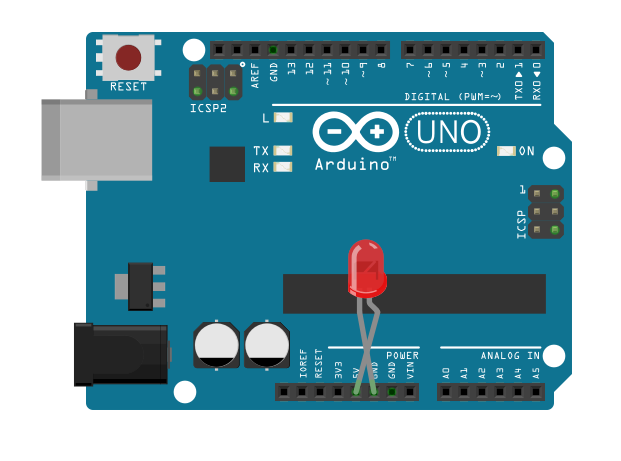

# 02.ソフトウェアとLED



ちょっとLED付けてみましょう。壊れるので、本当はダメです。

---

## ソフトウェア（IDE）説明

> IDE（総合開発環境）は　あなたのコンピュータで動作するAruduino専用のソフトウェアです。Prosessing言語を元にしたシンプルな言語を使って、Arduduinoボードで実行するスケッチを書くことができます。  
https://www.oreilly.co.jp/books/9784873117331/


#### ダウンロード
[https://www.arduino.cc/](https://www.arduino.cc/)

※最近はブラウザ版も出ています。[https://create.arduino.cc/editor](https://create.arduino.cc/editor)

#### ボードの選択
ツール > ボード > Aruduio leonardo

#### ポートの選択
ツール > ボード > /dev/cu.usbmodemXXXX  
※USBを繋げておく

**Windoesの場合**  
デバイスマネージャ > コントロールパネル
システム > デバイスマージャ  
接続されているポートが「ポート（COMとLPT）」の中に表示されます。あとはMacと同じです。

### GUI


### サンプルスケッチを開く

ファイル > スケッチの例 > 01.Basics > Blink


```
// コメントはメモ書きで事項とは無関係
/*
  Blink
  Turns on an LED on for one second, then off for one second, repeatedly.
 */
 
// setupは最初に一度だけ実行される
void setup() {
  // initialize digital pin 13 as an output.
  pinMode(13, OUTPUT);
}

// loopは、繰り返し実行される
void loop() {
  digitalWrite(13, HIGH);   // turn the LED on (HIGH is the voltage level)
  delay(1000);              // wait for a second
  digitalWrite(13, LOW);    // turn the LED off by making the voltage LOW
  delay(1000);              // wait for a second
}
```

---

## Arduino実習
### LED制御

直接13PINとGNDにさして、Lチカ
delayを変えてみる

ジャンプワイヤー  
LED  
長いほうが+  
短いほうが-  


#### delay()関数
delay(待ち時間);
指定された間だけ待つ（単位はミリ秒）

```
//その1
void setup() {
  pinMode(13, OUTPUT);
}

void loop() {
  digitalWrite(13, HIGH);
  delay(100);
  digitalWrite(13, LOW);
  delay(100);
}
```