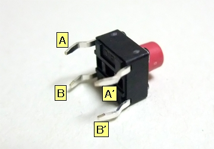
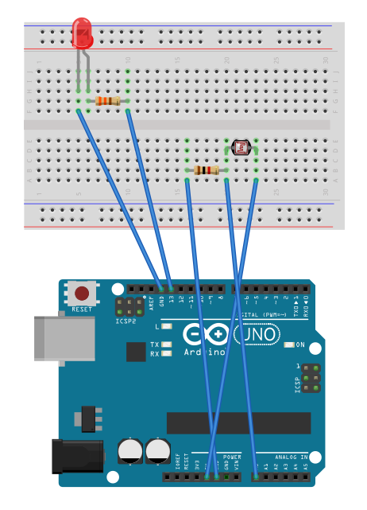

# 03.電子工作をやってみる

### ブレッドボード


ピンクの線がつながっている箇所は内部でつながっています。

### スイッチ


AとA'はつながっている  
BとB'はつながっている

スイッチを押している間は全部つながる

### ジャンプワイヤー
ジャンプワイヤーの色は自分の中でわかりやすいようにルールをつくりましょう。以下参考例  

- 黒：GND
- 赤：電源

```
/*
  Button
  sample > 02.digital > Button
 */

// ボタンに接続されたピンの番号
const int buttonPin = 2;

// LEDに接続されたピンの番号
const int ledPin =  13;

// ボタンの状態を表す変数
int buttonState = 0;

void setup() {
  // LEDに接続したピンのモードをOUTPUTにセット
  pinMode(ledPin, OUTPUT);
  // ボタンに接続したピンのモードをINPUTにセット
  pinMode(buttonPin, INPUT);
}

void loop() {
  // ボタンに接続したピンの状態を読み取る
  buttonState = digitalRead(buttonPin);

  // ボタンの状態がHIGHであれば
  if (buttonState == HIGH) {
    // LEDに接続したピンの値をHIGHにセットしてLEDを点灯
    digitalWrite(ledPin, HIGH);
  }
  // そうでなければ（ボタンの状態がLOWであれば）
  else {
    // LEDに接続したピンの値をLOWにセットしてLEDを点灯
    digitalWrite(ledPin, LOW);
  }
}
```


## オームの法則

E（電位差） = R x I

Rの数値を求めるために次の式に変形

R = （5 - 2）/ 0.01 = 300  
※1000Ω = 1kΩ


- 電圧 V（ボルト）  
- 電流 A（単位：アンペア）I  
- 抵抗 Ω（単位：オーム） R  

順電圧とは、LEDにかかる電圧のことで、オームの法則の電圧（R）部分には抵抗にかかる電圧（電位差）を入れる。

※LED 定格電圧2〜3V、定格電流5〜10mA  
※最大定格電流20mA  
※ぴったりの抵抗値をもつ抵抗器があるとは限らないので、近いものを使う。


**タクトスイッチにも抵抗をつけるのはなぜ？**  
プルダウン抵抗と言って、誤作動が無く、安定した入力を受け取れるようにする為。


### 光センサ

CdSセル（光センサ）といい、抵抗のようなもので、光が当たると抵抗値が下がる

Analog InはanalogRead()関数で0〜1023の数値を返せる  
※0〜5Vの電圧で表すため、2.5Vなら512

analogWrite()関数が受け付ける値の最大が255なので、4で割ります。  
analog 256の出力できる



※analogWriteが使えるのはPWNマークが付いたD3,D5,D6,D9,D10,D11のみ


```
// Example 06B: アナログ入力の値に応じてLEDの明るさを変える

const int LED = 9; // LEDがつながっているピン
int val = 0;       // センサからの値を記憶するピン

                   
void setup() {
  
  pinMode(LED, OUTPUT); // LEDのピンを出力に設定
                        // 注：アナログピンは自動で入力として設定される
}


void loop() {
  
  val = analogRead(0); // センサから値を読み込む
                       
  analogWrite(LED, val/4); // センサの値を明るさとしてLED点灯

  delay(10); // 少しの間プログラム停止
}
```
