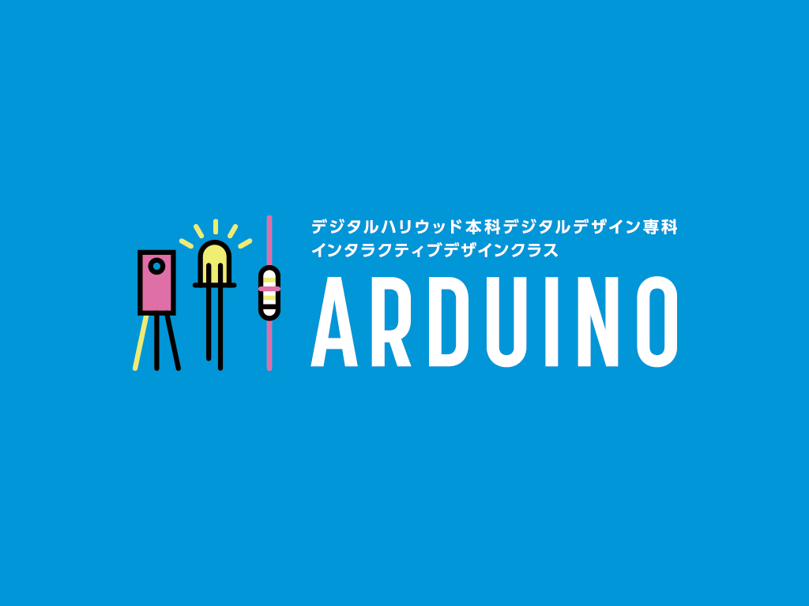

# Aruduino基礎

## デジタルハリウッド本科デジタルデザイン専科
### インタラクティブデザインクラス
#### ARUDUINO

- [01.Aruduinoとは](01.md)
	- どんな物が作れるか
	- 配布物の説明
	- Aruduino基盤の説明
- [02.ソフトウェアとLED](02.md)
	- Arduino（実習）
	- LED制御
- [03.電子工作をやってみる](03.md)
	- スイッチ
	- 光センサ
- [04.processingと繋ぐ](04.md)

---

## 授業概要

## 自己紹介

**本末英樹**  
フリーランス UIデザイナー

大学時代にメディアアートを勉強していて、それから仕事ではなけど、プライベートで作っています。

子どものおもちゃや小さなシンセサイザーなど小さな電圧の回路をショートさせて、新しい作品を作ることをサーキットベンディングと言います。この作品ではファミコンの内部をショートさせて、映像の出力を距離センサーでバグらせる作品を作りました。

- JUMP!  

Googleマップと赤外線センサーを使った作品

---

## その他

#### 参考書籍

**arduinoを始めよう**  
[http://amzn.to/1PpWut7](http://amzn.to/1PpWut7)

**Prototyping Lab**  
[http://amzn.to/2rHBKG8](http://amzn.to/2rHBKG8)

#### いろいろある
- 曲げセンサ
- 圧電スピーカー
- 3色LED
- 半固定抵抗
- 赤外線距離センサー
- マイク
- 傾斜
- 温度センサ

**スイッチサイエンス**    
[https://www.switch-science.com/](https://www.switch-science.com/)

**回路図作成ソフトの定番！『Fritzing』**  
[http://fritzing.org/download/](http://fritzing.org/download/)

