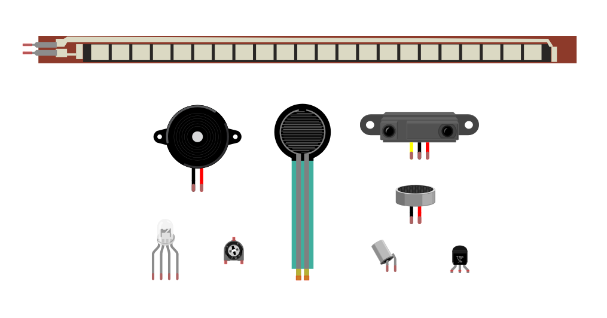

# Aruduino基礎
## デジタルハリウッド10/12 19:00〜

---

### ・自己紹介
###・Aruduinoとは
###・どんな物が作れるか
###・配布物の説明
###・Aruduino基盤の説明
###・IDE説明
###・Arduino（実習）
####　・LED制御
####　・スイッチ
####　・光センサ
###・processingと繋ぐ（講義）


---

##・自己紹介

本末英樹

フリーランス UIデザイナー

大学時代にメディアアートを勉強していて、
それから仕事ではなけど、プライベートで作っています。

###大学
- dot
- selfish
- bug


###最近
- お絵かKinect
- JUMP!
- DINO BOOK


---


##・Aruduinoとは

フィジカルコーンピューティングとかってよく言いますが、  
シンプルな入出力とProcessing言語で実装された開発環境がベースになったもの  
単体でも使えますが、Flashとか、Processing、OF、Max/MSPとかと一緒に使う。  
ソフトウェア（IDE）もオープンソースでDLできます。

アーティストやデザイナー、学生ががもっと気軽に
インタラクティブなコンテンツを開発するために作られた。

インタラクティブなデバイス


ハードウェアとソフトウェア


###公式サイト
[https://www.arduino.cc/](https://www.arduino.cc/)

Aruduino UNOが主流

###Aruduinoの種類  
[https://www.arduino.cc/en/Main/Products](https://www.arduino.cc/en/Main/Products)

- Aruduino UNO 3240円  
- Arduino Fio（ワイヤレス）3117円
- LilyPad Arduino 328（服に縫い付ける） 2,492円

ピンの数、動作電圧、メモリーの容量が違う

###他デバイスとの違いと利点

昔は、GainerやUSBキーボードエンコーダを使った  

####littlebits  
電子工作の知識不要だが、高価

[http://jp.littlebits.com/](http://jp.littlebits.com/)

####USBキーボードエンコーダー 
とても簡単だが、ON/OFFだけで、数値などは取れない。
プログラミングできない。
[http://shop.bird-electron.co.jp/shopdetail/018000000014/](http://shop.bird-electron.co.jp/shopdetail/018000000014/)


####Arduino
安価で、プログラミング可能
ちょっと勉強必要だが、フォーラムや書籍が充実してるので安心。


---

##・どんな物が作れるか


####NFC  
[https://learn.adafruit.com/babel-fish](https://learn.adafruit.com/babel-fish)

####無線（Xbee）  
真鍋大度＋石橋素 「particles」ができるまで  
[http://www.cbc-net.com/topic/2011/05/daito-motoi-particles-ycam/](http://www.cbc-net.com/topic/2011/05/daito-motoi-particles-ycam/)

---

##・配布物の説明


- LED
- タクトスイッチ
- CdSセル（光センサー）
- 抵抗 330Ω、1KΩ

---

##・Aruduino基盤の説明

ブレッドボードの説明

####アナログ入力PIN
A0番〜A5番
電圧0V〜5Vを0〜1023の数値で読み取れる

基盤の主な説明

リセットスイッチ
USB電源
外部電源 ACアダプター
電源関係 5V（+） GND（-）
アナログ入力
デジタル入出力
LED


ちょっとLED付けてみましょう。
壊れるので、本当はダメです。


---

##・IDE説明

####ダウンロード
https://www.arduino.cc/

####ボードの選択
ツール > ボード > Aruduio leonardo

####ポートの選択
ツール > ボード > /dev/cu.usbmodemXXXX  
※USBを繋げておく

####GUI


####サンプルスケッチを開く

ファイル > スケッチの例 > 01.Basics > Blink


```
// コメントはメモ書きで事項とは無関係
/*
  Blink
  Turns on an LED on for one second, then off for one second, repeatedly.
 */
 
// setupは最初に一度だけ実行される
void setup() {
  // initialize digital pin 13 as an output.
  pinMode(13, OUTPUT);
}

// loopは、繰り返し実行される
void loop() {
  digitalWrite(13, HIGH);   // turn the LED on (HIGH is the voltage level)
  delay(1000);              // wait for a second
  digitalWrite(13, LOW);    // turn the LED off by making the voltage LOW
  delay(1000);              // wait for a second
}
```

---

##・Arduino（実習）
###　・LED制御

直接13PINとGNDにさして、Lチカ
delayを変えてみる

ジャンプワイヤー  
LED  
長いほうが+  
短いほうが-  


####delay()関数
delay(待ち時間);
指定された間だけ待つ（単位はミリ秒）

```
//その1
void setup() {
  pinMode(13, OUTPUT);
}

void loop() {
  digitalWrite(13, HIGH);
  delay(100);
  digitalWrite(13, LOW);
  delay(100);
}
```

```
//その2
void setup() {
  pinMode(13, OUTPUT);
}

void loop() {
  digitalWrite(13, HIGH);
  delay(10);
  digitalWrite(13, LOW);
  delay(10);
}
```

```
//その3
void setup() {
  pinMode(13, OUTPUT);
}

void loop() {
  digitalWrite(13, HIGH);
  delay(1);
  digitalWrite(13, LOW);
  delay(19);
}
```

```
//その4
void setup() {
  pinMode(13, OUTPUT);
}

void loop() {
  digitalWrite(13, HIGH);
  delayMicroseconds(100);
  digitalWrite(13, LOW);
  delayMicroseconds(9900);
}
```


抵抗つける？

抵抗とLEDの順番はどちらでも大丈夫？

ブレッドボードの説明


###・スイッチ


AとA'はつながっている  
BとB'はつながっている

スイッチを押している間は全部つながる


####ブレッドボード


####ジャンプワイヤー
- 黒：GND
- 赤：電源

```
// SWITCH1
void setup() {
  pinMode(13, OUTPUT);
}

void loop() {
  boolean sw = digitalRead(2);
  digitalWrite(13, sw);
}
```

digitalRead()関数  
boolean b = digitalRead(ピン番号);

```
/*
  Button
  sample > 02.digital > Button
 */

// ボタンに接続されたピンの番号
const int buttonPin = 2;

// LEDに接続されたピンの番号
const int ledPin =  13;

// ボタンの状態を表す変数
int buttonState = 0;

void setup() {
  // LEDに接続したピンのモードをOUTPUTにセット
  pinMode(ledPin, OUTPUT);
  // ボタンに接続したピンのモードをINPUTにセット
  pinMode(buttonPin, INPUT);
}

void loop() {
  // ボタンに接続したピンの状態を読み取る
  buttonState = digitalRead(buttonPin);

  // ボタンの状態がHIGHであれば
  if (buttonState == HIGH) {
    // LEDに接続したピンの値をHIGHにセットしてLEDを点灯
    digitalWrite(ledPin, HIGH);
  }
  // そうでなければ（ボタンの状態がLOWであれば）
  else {
    // LEDに接続したピンの値をLOWにセットしてLEDを点灯
    digitalWrite(ledPin, LOW);
  }
}
```


####オームの法則

電圧 V（ボルト）  
電流 A（単位：アンペア）I  
抵抗 Ω（単位：オーム） R  


順電圧とは、LEDにかかる電圧

電源電圧（5V） - LEDの順電圧（2V） = LEDに流したい電流（抵抗器に流れる電流） x R 
E（電位差） = R x I

Rの数値を求めるために次の式に変形

R = （5 - 2）/ 0.01 = 300

3V = R x 0.01A  
R = 300Ω  
※1000Ω = 1kΩ

LED 2〜3V、5〜10mA
※最大定格電流20mA

ぴったりの抵抗値をもつ抵抗器があるとは限らないので、近いものを使う。

[抵抗のカラーコード（抵抗値）の読み方](http://www.jarl.org/Japanese/7_Technical/lib1/teikou.htm)


**タクトスイッチにも抵抗をつけるのはなぜ？**  
プルダウン抵抗と言って、誤作動が無く、安定した入力を受け取れるようにする為。


###・光センサ

CdSセル（光センサ）
抵抗のようなもの

光が当たると抵抗値が下がる

Analog InはanalogRead()関数で0〜1023の数値を返せる  
※0〜5Vの電圧で表すため、2.5Vなら512

analogWrite()関数が受け付ける値の最大が255なので、4で割ります。  
analog 256の出力できる


※analogWriteが使えるのはPWNマークが付いたD3,D5,D6,D9,D10,D11のみ


```
// Example 06B: アナログ入力の値に応じてLEDの明るさを変える

const int LED = 9; // LEDがつながっているピン
int val = 0;       // センサからの値を記憶するピン

                   
void setup() {
  
  pinMode(LED, OUTPUT); // LEDのピンを出力に設定
                        // 注：アナログピンは自動で入力として設定される
}


void loop() {
  
  val = analogRead(0); // センサから値を読み込む
                       
  analogWrite(LED, val/4); // センサの値を明るさとしてLED点灯

  delay(10); // 少しの間プログラム停止
}
```

※授業で、ピンの場所によって動かなかったので、注意書きを追加する。


---

##processingと繋ぐ（講義）

つなぐ方法は2つ

- ArduinoライブラリとFirmataを使用
- シリアル通信

```
// テルミンもどき
// Aruduino側

const int senserPin = 0; // 入力ピン
int val = 0;       // センサからの値を記憶するピン
const int LED = 9; // LEDがつながっているピン


void setup() {
  Serial.begin(9600); // シリアルポートを開く
  pinMode(LED, OUTPUT); // LEDのピンを出力に設定
}


void loop() {
  
  val = analogRead(senserPin) / 4; // センサから値を読み込む

  Serial.write((byte)val); // センサの値を送信
  analogWrite(LED, val * 4); // センサの値を明るさとしてLED点灯

  delay(100); // 少しの間プログラム停止
}

```

```
// テルミンもどき
// Prosessing側

import processing.serial.*;
import ddf.minim.*; //サウンドMinimライブラリ
import ddf.minim.signals.*;
 
Serial port;
Minim minim;
AudioOutput out;
SineWave sine;

float val;

void setup() {
  size(512, 100, P3D);
  frameRate(60);
  smooth();
  strokeWeight(2);
  
  //println(Serial.list());
  String arduinoPort = Serial.list()[1];
  port = new Serial(this, arduinoPort, 9600);
 
  minim = new Minim(this);
  out = minim.getLineOut();
  sine = new SineWave(440, 1.0, out.sampleRate());
  sine.portamento(200);
  out.addSignal(sine);
}
 
void draw() {
 
  if (port.available() > 0) {
    val = port.read();
    val = map(val, 0, 255, 0, height * 2);
  }
  println("値は" + val + "/256です");
  
  //波形を表示
  background(0);
  stroke(255);
  //バッファーに格納されたサンプル数だけくりかえし
  for (int i = 0; i < out.bufferSize() - 1; i++) {
    // それぞれのバッファーでのX座標を探す
    float x1  =  map( i, 0, out.bufferSize(), 0, width );
    float x2  =  map( i+1, 0, out.bufferSize(), 0, width );
    // 次の値へ向けて線を描く
    line( x1, 50 + out.left.get(i)*50, x2, 50 + out.left.get(i+1)*50); //始点 (x1,y1) から終点 (x2,y2) まで直線を引く
  }
    
  // 周波数をセンサーで読み取った値で変化させる
  float freq = map(val, 0, width, 20, 1000);
  sine.setFreq(freq);
}
```

```
println(Serial.list());
シリアルポートどれがつながれているか注意
```

**サウンドプラグイン「Minim」リファレンス**  
[http://code.compartmental.net/minim/](http://code.compartmental.net/minim/)

---

##その他

####参考書籍

**arduinoを始めよう**  
[http://amzn.to/1PpWut7](http://amzn.to/1PpWut7)

**Prototyping Lab**  
[http://amzn.to/1NC7t3o](http://amzn.to/1NC7t3o)


####セット

**SIDEKICK basic Kit**  
[http://amzn.to/1VNaooZ](http://amzn.to/1VNaooZ)  

**Arduino エントリーキット(Uno版）- Physical Computing Lab**  
[http://amzn.to/1GDHUXL](http://amzn.to/1GDHUXL)




####いろいろある
- 曲げセンサ
- 圧電スピーカー
- 3色LED
- 半固定抵抗
- 赤外線距離センサー
- マイク
- 傾斜
- 温度センサ


####回路図作成
http://fritzing.org/home/


**はんだづけカフェ**  
[http://handazukecafe.com/](http://handazukecafe.com/)

**スイッチサイエンス**    
[https://www.switch-science.com/](https://www.switch-science.com/)

- 秋月電子
- パルツーパーツ

#秋葉原の秋月電子にGO!


